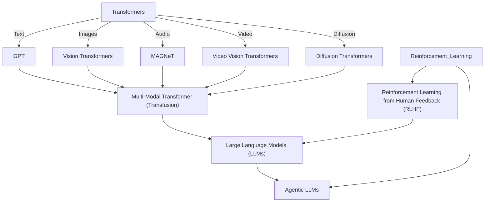

Hi, I'm Vachan! 

**Deep Learning and Systems Programming**

<be>


# Projects:
## [**NeuroForge**](https://github.com/VachanVY/NeuroForge):
* Implemented Neural Network (Forward and Backward Propagation), Batchnorm and Layernorm, Dropout from scratch just using basic tensor methods
* [Neural Networks](https://github.com/VachanVY/NeuroForge?tab=readme-ov-file#neural-networks) => [*nn.ipynb*](https://github.com/VachanVY/NeuroForge/blob/main/nn.ipynb)
  * [Logistic Regression](https://github.com/VachanVY/NeuroForge?tab=readme-ov-file#logistic-regression)
  * [MLP](https://github.com/VachanVY/NeuroForge?tab=readme-ov-file#logistic-regression)
    * [Forward Propagation (Explained on Pen and Paper)](https://github.com/VachanVY/NeuroForge?tab=readme-ov-file#logistic-regression)
    * [Back Propagation (Equations Derived on Pen and Paper)](https://github.com/VachanVY/NeuroForge?tab=readme-ov-file#logistic-regression)
    * [Gradient Descent](https://github.com/VachanVY/NeuroForge?tab=readme-ov-file#logistic-regression)
    * [Train Loop](https://github.com/VachanVY/NeuroForge?tab=readme-ov-file#logistic-regression)
    * [Results](https://github.com/VachanVY/NeuroForge?tab=readme-ov-file#results)
* [Batch-Normalization and Layer-Normalization: **Why When Where & How?**](https://github.com/VachanVY/NeuroForge?tab=readme-ov-file#results) => [*batchnorm.ipynb*]( https://github.com/VachanVY/NeuroForge/blob/main/batchnorm.ipynb), [*layernorm.ipynb*](https://github.com/VachanVY/NeuroForge/blob/main/layernorm.ipynb)
  * [Batch-Normalization](https://github.com/VachanVY/NeuroForge?tab=readme-ov-file#batch-normalization)
  * [Layer-Normalization](https://github.com/VachanVY/NeuroForge?tab=readme-ov-file#layer-normalization)
  * [Comparision](https://github.com/VachanVY/NeuroForge?tab=readme-ov-file#comparision)
* [Dropout: **Why When Where & How?**](https://github.com/VachanVY/NeuroForge?tab=readme-ov-file#dropout-paper-deep-learning-book) => [*dropout.ipynb*](https://github.com/VachanVY/NeuroForge/blob/main/dropout.ipynb), [*dropout_scale.ipynb*](https://github.com/VachanVY/NeuroForge/blob/main/dropout_scale.ipynb)
  * [Comparision before and after scaling the model](https://github.com/VachanVY/NeuroForge?tab=readme-ov-file#comparision-1) => [*dropout_scale.ipynb*](https://github.com/VachanVY/NeuroForge/blob/main/dropout_scale.ipynb), [nn_scale.ipynb](https://github.com/VachanVY/NeuroForge/blob/main/nn_scale.ipynb)
* [Adam and AdamW](https://github.com/VachanVY/NeuroForge?tab=readme-ov-file#adam-and-adamw-adam-with-weight-decay-optimizers)
  * [Adam](https://github.com/VachanVY/NeuroForge?tab=readme-ov-file#adam-and-adamw-adam-with-weight-decay-optimizers)
  * [AdamW](https://github.com/VachanVY/NeuroForge?tab=readme-ov-file#adam-and-adamw-adam-with-weight-decay-optimizers)

## Transformers


### [**gpt.jax**](https://github.com/VachanVY/gpt.jax): 
* GPT written in `jax`, trained on `tiny shakespeare dataset (1.1 MB text data)` and scaled it on the `tiny stories dataset (~2 GB text data)`
  | Model-Params       |`d_model`| `n_heads`  | `maximum_context_length` | `num_layers`  | `vocab_size` | Estimated Validation Loss on tiny stories dataset   |
  | :-------------:    |:-------:|:----------:|:------------------------:|:--------------|:------------:|:-------------------------:|
  | *280K*             |   64    |     8      |           512            |       5       |      512     |      **1.33**             |
  | *15M*              |   288   |     6      |           256            |       6       |     32000    |      **1.19**             |
  | *45M*              |   512   |     8      |           1024           |       8       |     32000    |      **TODO**             |
  | *110M*             |   768   |     12     |           2048           |       12      |     32000    |      **TODO**             |
* Model: `15M` | Prompt: `Once upon a time,` | Sampling Technique: `Greedy sampling`
    ```
    Once upon a time, there was a little girl named Lily. She loved to play with her toys and eat yummy food. One day, she found a big, round thing in her room. It was a microscope. Lily was very curious about it.
    Lily wanted to see what was inside the microscope. She tried to open it, but it was very hard. She tried and tried, but she could not open it. Lily felt sad and wanted to find a way to open the microscope.
    Then, Lily had an idea. She asked her mom for help. Her mom showed her how to open the microscope. Lily was so happy! She looked through the microscope and saw many tiny things. She was so excited to see the tiny things. Lily and her mom had a fun day together.
    ```
* Prompt: `Once upon a time, in a big forest, there was a fearful little dog named Spot` | Sampling Technique: `Greedy sampling`
    ```
    Once upon a time, in a big forest, there was a fearful little dog named Spot. Spot was scared of many things. One day, Spot saw a big tree with a hole in it. He thought, "I want to see what is inside the hole."
    Spot went to the tree and looked inside the hole. He saw a little bird with a hurt wing. Spot said, "I will help you, little bird." He used his paw to gently lift the bird out of the hole. The bird was very happy and said, "Thank you, Spot!"
    Spot and the bird became good friends. They played together in the forest every day. Spot learned that it is good to help others, even if they are scared of something. And they lived happily ever after.
    ```

### [**Diffusion Transformers**](https://github.com/VachanVY/diffusion-transformer)
* [**CelebA**](https://github.com/VachanVY/diffusion-transformer?tab=readme-ov-file#celeba) 
   * **[Generated-images](https://github.com/VachanVY/diffusion-transformer?tab=readme-ov-file#generated-images)** <====== See the Model Generated Images here
   * **[Training-insights](https://github.com/VachanVY/diffusion-transformer?tab=readme-ov-file#training-insights)**
* **[MNIST-experiment](https://github.com/VachanVY/diffusion-transformer?tab=readme-ov-file#mnist-experiment)**
   * [**Training on MNIST**](https://github.com/VachanVY/diffusion-transformer?tab=readme-ov-file#training-on-mnist)
* **[Diffusion-Transformers Paper Summary](https://github.com/VachanVY/diffusion-transformer?tab=readme-ov-file#latent-diffusion-models)**
* Some generated images:\
    
    
    
    
    
    

<!-- ### [**ViViT**](https://github.com/VachanVY/ViVIT):
* Video Vision Transformer in PyTorch
* Test trained on MNIST images by stacking images of the same digit in the time dimension
* TODO: Scale the model and train it on a proper large dataset...

### [**Vision-Transformers**](https://github.com/VachanVY/Vision-Transformers):
* Vision Transformers in `jax`, trained on `MNIST` dataset
* TODO: Scale ViT and train on a larger dataset -->

<!-- 
### **Mugen**
* Going to make a website for music generation using *Pytorch* only. On-going project...
* TODO: Test train it on the MusicBench dataset, takes 5 seconds/step on my GPU, very slow... need GPUs
* TODO: Scale on large lyrical music datasets
* Repeat for the below models
* ### Models for this Project
  * - [x] [Non Autoregressive Transformer](https://github.com/VachanVY/MAGNeT)
  * - [ ] Autoregressive Transformer
  * - [ ] Diffusion Transformer
-->

# [Reinforcement-Learning](https://github.com/VachanVY/Reinforcement-Learning)
> Below links don't redirect anywhere, gotta refactor the code and add links, for now go to the repo directly👆
## Reinforcement Learning: An Introduction by Andrew Barto and Richard S. Sutton
* [Dynamic Programming]()
  * [Policy Iteration - Policy Evaluation & Policy Iteration]()
  * Value Iteration **TODO**
* [Monte-Carlo Methods]()
  * [Monte Carlo Exploring Starts]()
* [Temporal-Difference (Tabular)]()
  * [Sarsa]()
  * [Q-learning]()
  * [Expected Sarsa]()
  * Double Q-learning **(TODO)**
* [n-step Bootstrapping (**TODO**)]
* Planning and Learning with Tabular Methods (**TODO**)
* [On-policy Prediction with Approximation]()
  * Covered in [Papers]() Section, where we use function approximators like Neural Networks for RL
* On-policy Control with Approximation (**TODO**)
* Off-policy Methods with Approximation (**TODO**)
* Eligibility Traces (**TODO**)
* [Policy Gradient Methods]()
  * [Monte-Carlo Policy-Gradient]()
  * [REINFORCE with Baseline]()
  * [One-Step Actor-Critic]()
  * Policy Gradient on Continuous Actions (**TODO**)

---
## Reinforcement Learning: Paper Implementations
* [2013: Playing Atari with Deep Reinforcement Learning]()
* Prioritized DDQN || 2015: Deep Reinforcement Learning with Double Q-learning **+** 2016 Prioritized Experience Replay || **(TODO)**
* [2017: Proximal Policy Optimization (PPO)]()
* 2014: Deterministic Policy Gradient **(TODO)**
* 2018: Soft Actor-Critic **(TODO)**
* AlphaGo, AlphaZero, AlphaFold, etc: **(TODO)**
  * 2017: Mastering the game of go without human knowledge
  * 2017: AlphaZero
  * 2020: Mastering Atari, Go, chess and shogi by planning with a learned model
  * 20xx: AlphaFold
* (many more to be added...)
---

### [Transfusion (A Multi-Modal Transformer)](https://github.com/VachanVY/Transfusion.torch)
* Transfusion is a Multi-Modal Transformer, it can generate text like GPTs and images like Diffusion Models, all at once in one go not separately!
* It can easily switch between text and image modalities for generations, and it is nothing complicated, just a single transformer with some modality-specific components!
* This can easily be extended to other modalities like videos, audio, etc, but for now, it can only take images and text as input
* **`TODO`: Train on a large Multi-Modal Dataset (something like tiny stories dataset with images in between illustrating the story...?)**


<br>


<br><br>

